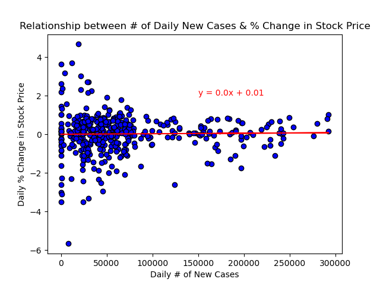

# Project-1 Final Write-Up

Presentation: https://docs.google.com/presentation/d/1-4dF2DChIU2I0XD3FN9EB1t10tX8XLa15NWx-IifCHs/edit?usp=sharing

## Section 1: S&P500 Index Before and After Pandemic Began
Authored by Galen Kellner

Examined index historical data to determine broad impact of the pandemic on market trends.

First, examined daily trade volume of the index over each year to determine pandemic impact on market activity. 

In 2019, trade volume fluctuated irregularly with a mean of approximately 7e+8 and a standard deviation of 2.6e+7. This meant that volume generally stayed within a proportionally small range of values, never exceeding 2e+8. 

In 2020, for much of the year trade volume fluctuated in a similar range as 2019 with the notable exception of March and April having a significant spike, reaching up to 3.92e+8. This spike coincided with the pandemics' first big blow-up in the United States. It also shifted the mean and standard deviation a great deal with the 2020 volume mean being 1.004e+8 and the standard deviation being 6.9e+7.

Im summary, the growth of the epidemic seemed to lead to greatly increased activity in the market.

Second, examined daily price amplitude of the index over the course of 2019 and 2020.  In this context, amplitude refers to the difference bewteen daily price high-point and low-point.  This measure gives an indication of the price volatility over the course of each day before and during the pandemic.

2019 had a mean amplitude of $2.42 with a standard deviation of $1.30 and a max of $8.97.  This showed that, during 2019, the S&P500 index had a fairly stable price each day.

In 2020 however, the mean of the price amplitude was $5.47, the standard deviation was $4.00, and the maximum was $22.39.  Compared to the previous year without the pandemic in effect, the daily price of the impact fluctuated far more with a greater magnitude.  The price instability peaked in mid-March and April but there was also multiple occasions throughout the year with spikes higher than the previous year's maximum value.

In summation, the index data strongly indicates that pandemic activity leads to price instability over the course of the day.  This information could be useful for day-traders looking to make money in the future.

## Section 2: Looking at trends and relationship between variables throughout the pandemic
Authored by Diane Tiblin 

For all the noise surrounding stock market panic, you can see in the graphs that after the initial panic/crash at the beginning of the pandemic, it seemed to really just resume normal upward course. It only took about 6 months to reverse the loss of value from the initial crash and has been steadily climbing since, seemingly unaffected by the highs and lows of the pandemic. There appears to be only some minor mirror effect happening early on in those first 6 months or so. Most interestingly this seems to confirm a buy-and-hold strategy, even in the midst of this volatile time. Anyone invested in a market index would have roughly doubled their value since the initial crash. 

The correlation between the S&P price and COVID cases is only .3 for the duration of the pandemic. As you can see in the graph, the shape of their relationship takes the same shape as the pandemic over time. The relationship between them would appear to be better explained simply by time passed, in that stock price went up over time. 

While the relationship between # of Daily new COVID cases and % change in stock price shows nearly zero correlation, there do appear to be some visual trends in the scatter plot. One might assume that more COVID cases would mean more volatility in the world, and hence reflected in the stock price. However, the stock price appears to be most stable while the cases are higher, for the most part hovering near 0 % change. More volatility can be seen at the lower end of the # of COVID cases. This most likely has to do with the initial market crash at the beginning of the pandemic when cases were still naturally low, but you can also see both more and larger increases in stock price at the lower end as wel. This could confirm evidence of more individuals getting back into the market at time when cases are at their lowest, while individuals already in the market at the worst times in the pandemic appear to be primarily holding instead of panic selling. 

One trend that occured during the pandemic is the idea that large #s of indivduals were jumping into the market day-trading cheaply via Robinhood, out of sheer pandemic boredom. We wanted to see if that trend was confirmed, and if trading volume stayed high throughout the pandemic, returned to more normal levels as we also returned to more normal activities, or spiked everytime the pandemic worsened. You can see the large spike in trading in the first month or so of the pandemic and then it sort of tapers off to a more even level. There does appear to be some degree of volatility but likely unrelated to straight COVID cases/concerns of a worsening pandemic. There doesn’t appear to be a large correlation between the trading volume and new COVID cases, only -.3 for the duration of the pandemic. 

## Section 3:
Authored by Thomas Martin

Researched and put into visualization the correlations between certain categories of stocks and how they were and still are uniquely affected by the Covid-19 pandemic.  Looked at stocks that involve travel and human contact, as well as stocks that rely completely on digital environments, such as Zoom and Facebook. For example, in the graph below, you can see that some stocks had a positive reaction to the pandemic. 

This raises some questions about the economy's overall health and reaction to a pandemic, such as: Is the entire market always affected?  What parts of the market are hurt by it and which ones flourish from it?  Why do some stocks rebound beyond their original position, why others stay down?
It seems there are lots of different factors that can be looked at.  For example, the stock price for United Airlines has remained down since the pandemic hit, where as the stock price for Six Flags has rebounded higher than ever, even though both involve contact with other people.  Some factors to consider are: Travel Regulations of other countries, which could be why flights are still hurting.  Also, vaccination and people's general feeling of wanting to go back to "normal" may be a contributing factor for stocks involving themeparks and movie theaters etc. to rebound.

